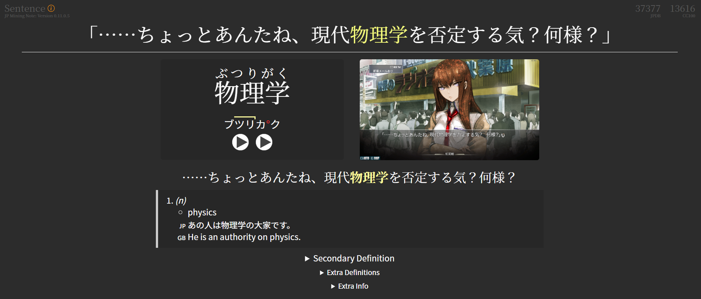
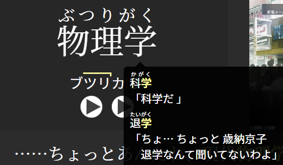
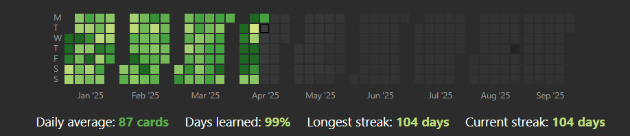

# Anki Setup

<figure markdown="span">
    
</figure>

### Download
Get the latest version from [Official Anki Download Page](https://apps.ankiweb.net/#downloads).

### Preferences
Go to `Tools→Preferences` and set all settings as below. Configure **Answer Keys** to your liking.

#### Apperance Tab

#### Review Tab

#### Editing Tab

#### Syncing Tab
Log into your AnkiWeb Account on **Syncing** page.

#### Other Tabs
Set remaining tabs to whatever.

### Presets
Default Preset for Japanese:

* 10 new cards a day
* All available reviews
* New cards with 5min → 15min steps
* Failed cards with 10min → 1hour steps
* After 5 failed reviews card is suspended

### Note Type
My favourite Anki Note Type for Japanese is [jp-mining-note](https://github.com/arbyste/jp-mining-note). You can find installation gudie [here](https://arbyste.github.io/jp-mining-note/setup/#installing-jp-mining-note). After that you can read through [Reference](https://arbyste.github.io/jp-mining-note/ui/) to understand card structure and Note Type features.

!!! example
    You can download [my sample card](https://drive.google.com/file/d/1EpV1fMM3mi5A1MsDRPjv_sGjAWMqP-bF/view?usp=sharing) to see how I usually use this template. The only thing I changed is the field order to make card creation a bit easier.

One of my favourite things about this note is that you can hover over kanji and see in which your other card this kanji was used. Very helpful to make connections between cards and increase retantion rate.

!!! warning
    Card will create a warning if you have multiple cards for the same word. I personally ignore them and don't mind having multiple cards in multiple contexts for complicated words.

### Add-ons

Highly recommended to install listed below essential add-ons. Navigate to `Tools→Add-ons`, push `Get Add-ons...`, and type the code according to addon page. Then some of these add-ons will have `Config` option or separate settings button in `Tools` tab which you can tweak up to your liking. I leave everything at default, except Review Heatmap.

#### Essentiual add-ons

* [**AnkiConnect**](https://ankiweb.net/shared/info/2055492159) (2055492159): essential add-on to connect anki to external apps such as yomitan dictionaries
* [**AJT Japanese for JP Mining Note**](https://ankiweb.net/shared/info/200813220) (200813220): furigana and pitch accent generator for jp-mining-note Note Type
* [**VOICEVOX Japanese Text To Speech Audio Generator**](https://ankiweb.net/shared/info/366960193) (366960193): AI TTS generator
* [**Review Heatmap**](https://ankiweb.net/shared/info/1771074083) (1771074083): review activity visualization GitHub style

!!! note
    I recommend to put heatmap `Tools→Review Heatmap Options...` in **Continuous Timeline** for better looks.
    

#### Optional add-ons

* [**Kanji Grid Kuuube**](https://ankiweb.net/shared/info/1610304449) (1610304449): learnt kanji visualization
* [**FSRS Helper**](https://ankiweb.net/shared/info/759844606) (759844606): additional useful functionality for anki scheduler
* [**Advanced Browser**](https://ankiweb.net/shared/info/874215009) (874215009): more features to anki browser

### Setup Completed
Now your Anki Setup should be completed, congratulations! :heart:

As the next setup, you can go to [setting up Yomitan](/jpguides/yomitan/) for quick look ups and easy card creation.

### Thanks

* [Damien Elmes](https://github.com/dae) and [Anki Team](https://github.com/ankitects/anki/graphs/contributors) for the best software in existence
* [Shigeyuki](https://www.reddit.com/user/Shige-yuki/) for Anki-tan
* [Aquafina-water-bottle](https://github.com/Aquafina-water-bottle) and [arbyste](https://github.com/arbyste) for [jp-mining-note](https://github.com/arbyste/jp-mining-note)