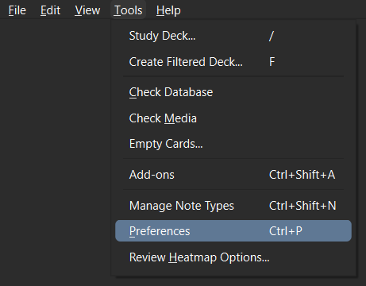
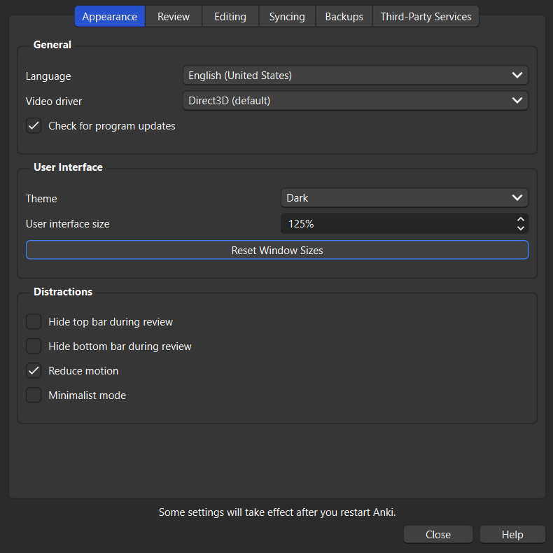
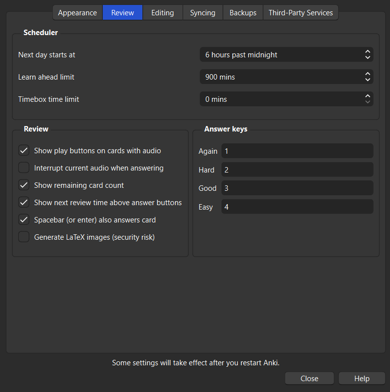
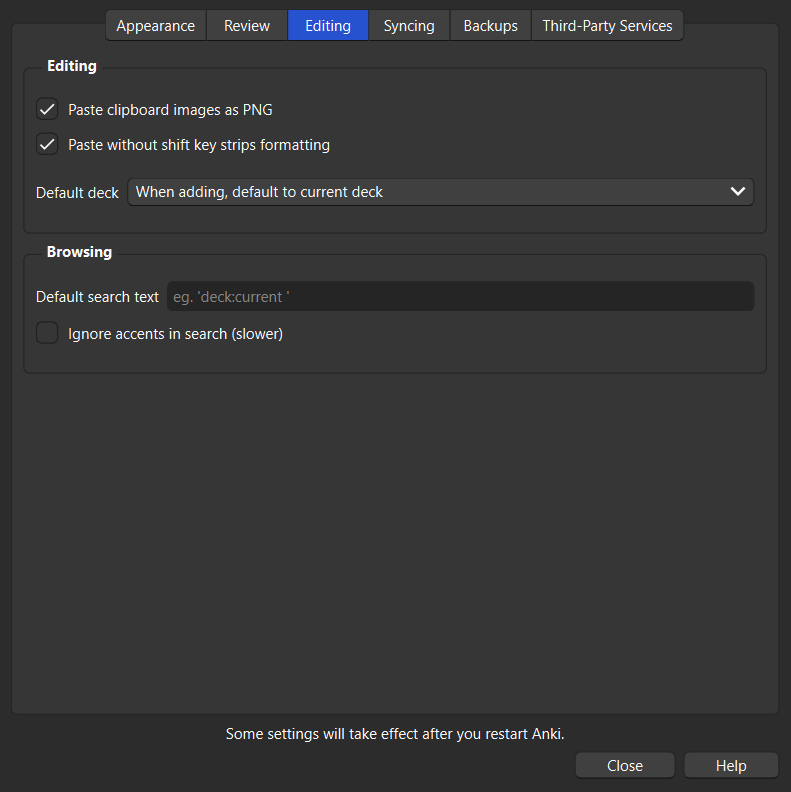
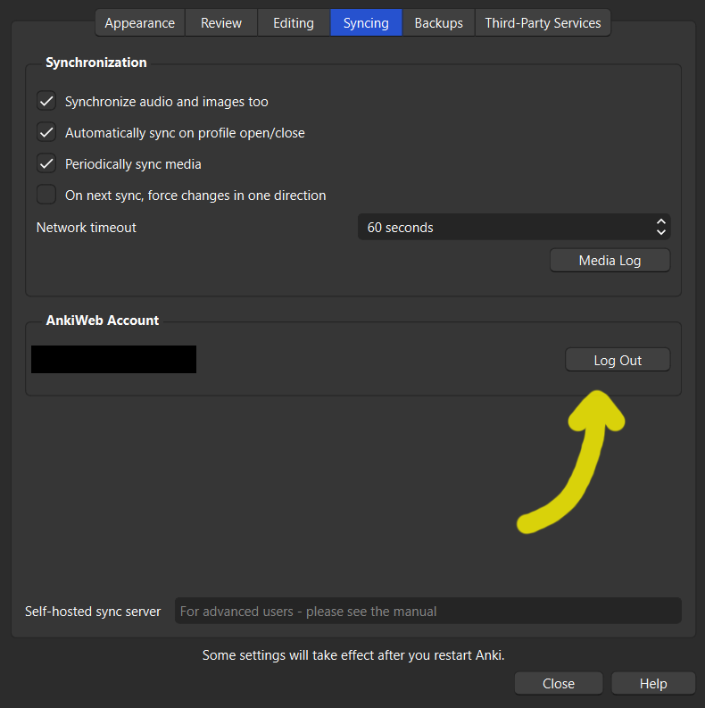

# Anki Setup

<figure markdown="span">
    
</figure>

### Download

Get the latest version from [Official Anki Download Page](https://apps.ankiweb.net/#downloads).

### Preferences
Go to `Tools→Preferences` and set all settings as below. Configure **Answer Keys** to your liking.

Log into your AnkiWeb Account on **Syncing** page.

### Presets

Default Preset for Japanese.
* 10 new cards a day
* All available reviews
* New cards with 5min → 15min steps
* Failed cards with 10min → 1hour steps
* After 5 failed reviews card is suspended

### Note Type

### Add-ons